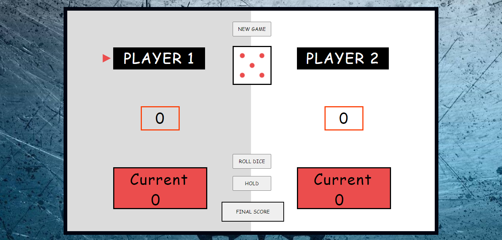

# WebGame-HTML5-CSS3-JS

Rules for Winning

: You can role dice ROLL DICE until a 1 comes on dice.

: If 1 comes on dice , your current total score is zero and chance goes to next player.

: If u want to hold your current score ,ie, add current score to total then u click HOLD.

: The first one to get a total of 20 wins the game.

